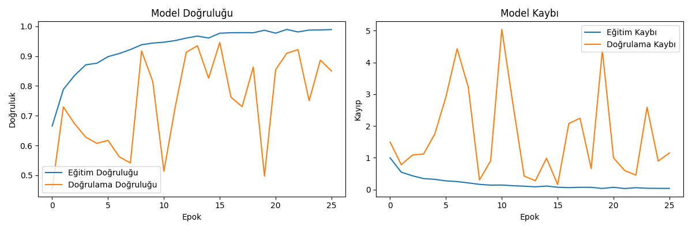
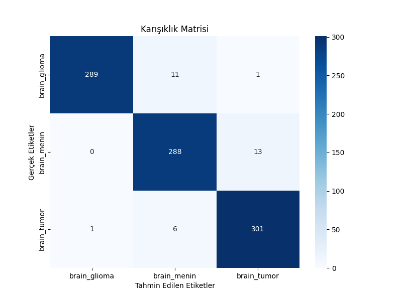

# 🧠 Beyin Tümörü Sınıflandırma Sistemi

[](https://python.org)
[](https://tensorflow.org)
[](https://github.com/)

> **Beyin MR görüntülerinden otomatik tümör sınıflandırması için derin öğrenme tabanlı kapsamlı çözüm**

---

<p align="center">
  <br></p>

---

## 📋 İçindekiler

* [📌 Proje Hakkında](#-proje-hakkında)
* [📊 Performans Sonuçları](#-performans-sonuçları)
* [🚀 Hızlı Başlangıç](#-hızlı-başlangıç)
* [⚙️ Sistem Gereksinimleri](#️-sistem-gereksinimleri)
* [📂 Veri Kümesi](#-veri-kümesi)
* [🛠️ Kurulum](#️-kurulum)
* [▶️ Kullanım](#️-kullanım)
* [📈 Model Mimarisi](#-model-mimarisi)
* [📁 Proje Yapısı](#-proje-yapısı)
* [🛠️ Teknolojiler](#️-teknolojiler)
* [📝 Notlar](#-notlar)
* [🤝 Katkıda Bulunun](#-katkıda-bulunun)
* [📄 Lisans](#-lisans)

---

## 📌 Proje Hakkında

Bu proje, beyin MR görüntülerini **üç ana kategoride** sınıflandırmak için tasarlanmış, **özel bir Derin Sinir Ağı (CNN)** içerir:

| Sınıf             | Açıklama                                        |
| ----------------- | ----------------------------------------------- |
| **Glioma Tümörü** | Beyin dokusunda oluşan tümörler                 |
| **Menenjiyom**    | Menenjlerden kaynaklanan yavaş büyüyen tümörler |
| **Tümör**         | Çeşitli tümör türlerini içeren genel kategori   |

---

## 📊 Performans Sonuçları

> Aşağıdaki sonuçlar **test seti** üzerinde elde edilmiştir.

| Metrik                     | Değer      |
| -------------------------- | ---------- |
| **Doğruluk (Accuracy)**    | **%96.48** |
| **Hassasiyet (Precision)** | **%96.48** |
| **Duyarlılık (Recall)**    | **%96.48** |
| **F1‑Skoru**               | **%96.48** |

<details>
<summary>📑 Detaylı Sınıflandırma Raporu (tıklayın)</summary>

```text
              precision    recall  f1-score   support

     Glioma       0.95      0.96      0.95       300
  Meningiom       0.96      0.98      0.97       306
       Tümör      0.98      0.96      0.97       294

    accuracy                           0.96       900
   macro avg       0.96      0.96      0.96       900
weighted avg       0.96      0.96      0.96       900
```

</details>

---

## 🚀 Hızlı Başlangıç

### 🔄 Depoyu Klonlayın

```bash
git clone https://github.com/kullanici/brain-tumor-cnn.git
cd brain-tumor-cnn
```

### 🐍 Sanal Ortam Oluşturun

```bash
# Linux / macOS
python3 -m venv .venv && source .venv/bin/activate

# Windows
python -m venv .venv && .venv\Scripts\activate
```

### 📦 Bağımlılıkları Kurun

```bash
pip install -r requirements.txt
```

### 🏃‍♂️ Eğitimi Başlatın

```bash
python basit_cnn_v2.py
```

---

## ⚙️ Sistem Gereksinimleri

<details>
<summary>🖥️ Donanım</summary>

|              | Minimum    | Önerilen           |
| ------------ | ---------- | ------------------ |
| **CPU**      | 4 çekirdek | 8 çekirdek         |
| **RAM**      | 8 GB       | 16 GB              |
| **Depolama** | 10 GB      | 20 GB              |
| **GPU**      | —          | NVIDIA, 8 GB+ VRAM |

</details>

<details>
<summary>💽 Yazılım</summary>

* **İşletim Sistemi**

  * Ubuntu 20.04 + / Windows 10 + (64‑bit)
* **GPU Desteği**

  * NVIDIA Sürücüleri & CUDA 12.x & cuDNN 8.9 +

</details>

---

## 📂 Veri Kümesi

| Sınıf          | Örnek Sayısı | Açıklama                                        |
| -------------- | ------------ | ----------------------------------------------- |
| **Glioma**     | 2 001        | Beyin dokusunda oluşan tümörler                 |
| **Menenjiyom** | 2 004        | Menenjlerden kaynaklanan yavaş büyüyen tümörler |
| **Tümör**      | 2 048        | Çeşitli tümör türlerini içeren genel kategori   |

> Veri kümesi **otomatik** olarak eğitim, doğrulama ve test kümelerine ayrılır.

---

## 🛠️ Kurulum

### Linux

```bash
sudo apt update && sudo apt upgrade -y
sudo apt install -y python3-pip python3-venv
```

### Windows

1. [Python 3.10+](https://www.python.org/downloads/) indirin.
2. **Install launcher for all users** ve **Add Python to PATH** seçeneklerini işaretleyin.
3. *Opsiyonel*: **Geliştirici Modu** ‑ Ayarlar ▸ Güncelleme & Güvenlik ▸ Geliştiriciler ▸ **Geliştirici Modu**.

---

## ▶️ Kullanım

### ⚒️ Eğitim Komutu

```bash
python basit_cnn_v2.py
```

### 📂 Çıktılar

Eğitim tamamlandığında proje dizininde **otomatik** olarak aşağıdaki dosya/klasörler oluşturulur:

| Yol                                                     | İçerik                                                           |
| ------------------------------------------------------- | ---------------------------------------------------------------- |
| `models/saved_models/model_<timestamp>.h5`              | **En iyi** eğitilmiş model ağırlıkları                           |
| `models/checkpoints/best_model_<timestamp>.h5`          | Eğitim sırasında kaydedilen en iyi ara model                     |
| `results/plots/training_history_<timestamp>.png`        | Eğitim & doğrulama **doğruluk/kayıp** grafiklerini içeren görsel |
| `results/confusion_matrices/cm_<timestamp>.png`         | Test seti için **karışıklık matrisi**                            |
| `results/metrics/metrics_<timestamp>.json`              | Ayrıntılı metrikler (accuracy, precision, recall, F1 vs.)        |
| `results/metrics/classification_report_<timestamp>.txt` | İnsan okunabilir sınıflandırma raporu                            |
| `results/training_results_<timestamp>.json`             | Eğitim meta verileri (epoch sayısı, süre, dosya yolları vb.)     |
| `logs/tensorboard/<timestamp>/`                         | TensorBoard logları                                              |

<details>
<summary>🎞️ Örnek Görseller (tıklayın)</summary>

<p align="center">
  
  <br/><br/>
  
</p>

> **Not:** Örnek dosyalar tamamen gerçek kod çıktılarıdır.

</details>
```
models/saved_models/   # En iyi modeller
results/metrics/       # Kayıtlı metrikler
results/plots/         # Eğitim grafikleri
logs/tensorboard/      # TensorBoard logları
```

### 📊 TensorBoard

```bash
tensorboard --logdir logs/tensorboard
```

---

## 📈 Model Mimarisi

| Özellik              | Değer                                   |
| -------------------- | --------------------------------------- |
| **Model Türü**       | Özel CNN                                |
| **Giriş Boyutu**     | 224 × 224 × 3 (RGB)                     |
| **Çıkış Katmanı**    | 3 nöronlu **Softmax**                   |
| **Optimizasyon**     | Adam (LR = 0.001)                       |
| **Kayıp Fonksiyonu** | Categorical Cross‑Entropy               |
| **Batch Boyutu**     | 32                                      |
| **Epoch**            | 100 (🥇 Erken durdurma: 10 epoch sabır) |

<details>
<summary>🚀 Performans İyileştirmeleri</summary>

* **Öğrenme Oranı Azaltma** – 2 epoch iyileşme olmazsa **%20** düşürülür.
* **Model Checkpoint** – Her epoch’ta **en iyi model** kaydedilir.
* **Veri Artırma** – Rastgele döndürme, yakınlaştırma, parlaklık ayarı.

</details>

---

## 📁 Proje Yapısı

```text
brain-tumor-cnn/
├── data/
│   ├── splits/          # Bölünmüş veri kümeleri
│   └── raw/             # Ham veri (opsiyonel)
│
├── models/
│   ├── saved_models/    # Kaydedilmiş modeller
│   └── checkpoints/     # Kontrol noktaları
│
├── results/
│   ├── metrics/         # Metrik dosyaları
│   └── plots/           # Eğitim grafikleri
│
├── logs/
│   └── tensorboard/     # TensorBoard logları
│
├── basit_cnn_v2.py      # Ana eğitim kodu
└── requirements.txt     # Python bağımlılıkları
```

---

## 🛠️ Teknolojiler

| Alan               | Kütüphaneler           |
| ------------------ | ---------------------- |
| **Derin Öğrenme**  | TensorFlow 2.19 +      |
| **Veri İşleme**    | NumPy, Pandas          |
| **Görselleştirme** | Matplotlib, Seaborn    |
| **Görüntü İşleme** | OpenCV, Pillow         |
| **Metrikler**      | Scikit‑learn           |
| **Geliştirme**     | Jupyter Notebook, tqdm |

---

## 📝 Notlar

* En iyi performans genellikle **20‑30 epoch** arasında elde edilir.
* **GPU** kullanımı, eğitim süresini **önemli ölçüde** azaltır.
* Kapsamlı **veri artırma teknikleri** performansı artırır.

---
---
